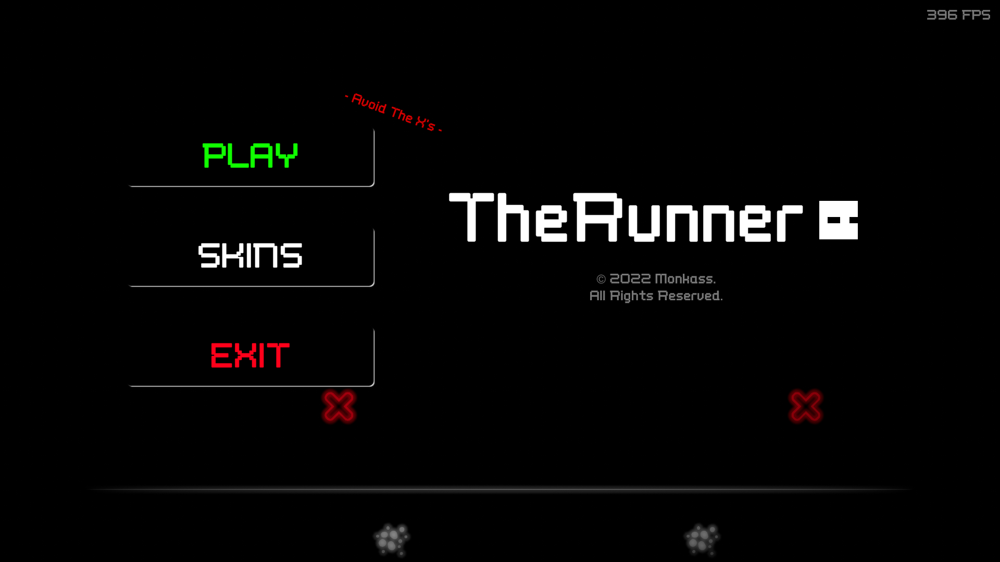
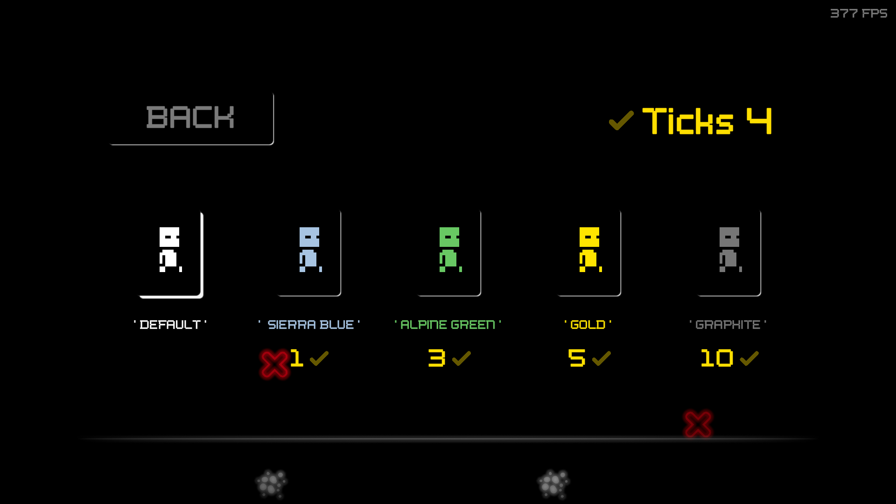
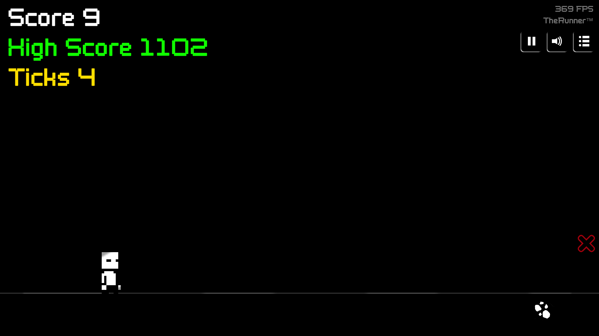

# 🎮 Runner Game

A fast-paced 2D side-scrolling arcade game inspired by classic infinite runners like the Chrome Dinosaur Game, but with enhanced mechanics and visual appeal. Players control a nimble character automatically moving forward through an ever-accelerating obstacle course.

---

## 🛠️ Technologies Used

- **Unity**
- **Unity UI / UGUI (Interface Design)**
- **C#**
- **VS Code** (development IDE)

---

## 📄 License

This project is open-source.

---

## 🤝 Contributing

Pull requests are welcome! Please follow standard GitHub flow and keep the code clean and documented.

---

## 📬 Contact

For questions, contact me at [obrizanou@gmail.com](mailto:obrizanou@gmail.com) or open an issue.
